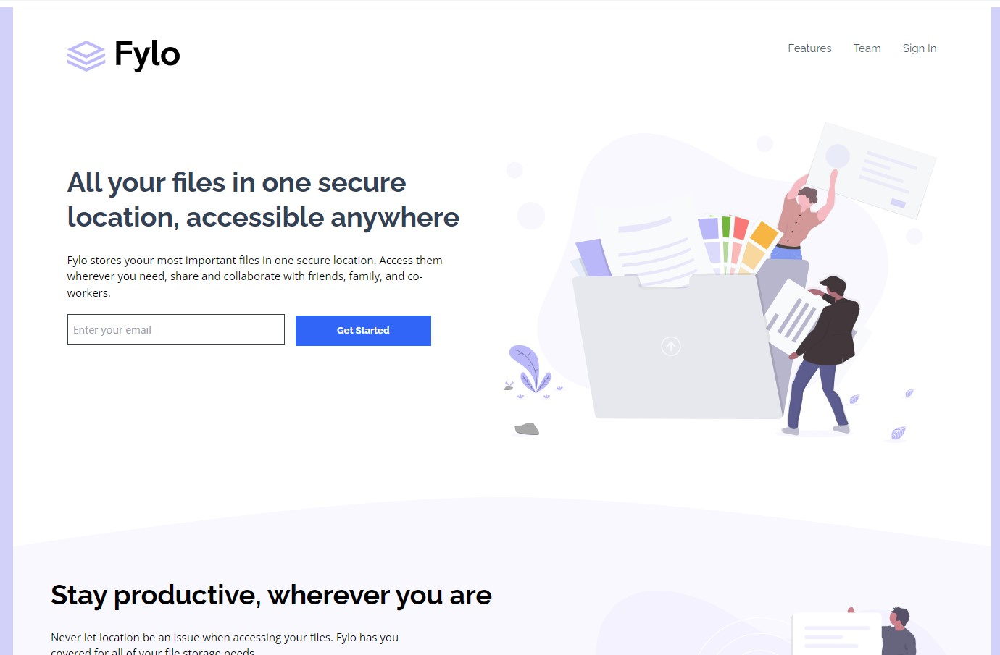

# Frontend Mentor - Fylo landing page with two column layout solution

This is a solution to the [Fylo landing page with two column layout challenge on Frontend Mentor](https://www.frontendmentor.io/challenges/fylo-landing-page-with-two-column-layout-5ca5ef041e82137ec91a50f5). Frontend Mentor challenges help you improve your coding skills by building realistic projects. 

## Table of contents

- [Overview](#overview)
  - [The challenge](#the-challenge)
  - [Screenshot](#screenshot)
  - [Links](#links)
- [My process](#my-process)
  - [Built with](#built-with)
  - [What I learned](#what-i-learned)
  - [Continued development](#continued-development)
  - [Useful resources](#useful-resources)
- [Author](#author)
- [Acknowledgments](#acknowledgments)


## Overview

### The challenge

Users should be able to:

- View the optimal layout for the site depending on their device's screen size
- See hover states for all interactive elements on the page

### Screenshot




### Links


- Solution URL:  [Github repository]()
- Live Site URL:  [Netlify]()


## My process

### Built with

- Semantic HTML5 markup
- Tailwind CSS
- Flexbox
- CSS Grid
- Mobile-first workflow
- [React](https://reactjs.org/) - JS library


### What I learned

- Solved a problem setting four columns layout in the Footer component. Using Grid didn't work OK. Thanks to BlackBox AI, I found the solution below.
- Found the way to modify size of the Logo image, thanks also to BlackBox AI. Some original properties of the svg are commented out.

```js

const Footer = () => {
  return (
    <footer className="w-[375px] mx-auto pt-12 px-10 pb-10 bg-vd-blue 2xl:w-[1440px] 2xl:h-[390px] 2xl:-mt-6 2xl:pb-0">
      <div className="2xl:flex 2xl:flex-wrap 2xl:justify-between">
        <div className="2xl:w-1/4 2xl:pt-8">
          <svg
            className="w-[105px] h-[30px]"
            viewBox="0 0 166 49"
            //   width="166"
            //   height="49"
            xmlns="http://www.w3.org/2000/svg"          
            xmlnsXlink="http://www.w3.org/1999/xlink"

```


### Continued development


Continue improving my coding skills by developing challenging applications, like this one.


### Useful resources

- BlackBox AI. Installed as VS Code extension. Provided solutions for styling the Footer and for a form validation snippet in the Hero component.


## Author


- Website - [Guillermo Dominguez](https://gdominguez2024.vercel.app/)
- Frontend Mentor - [@memominguez](https://www.frontendmentor.io/profile/memominguez)


## Acknowledgments


Thanks to all those who share their knowledge, free of charge, through video tutorials in the youtube platform.

